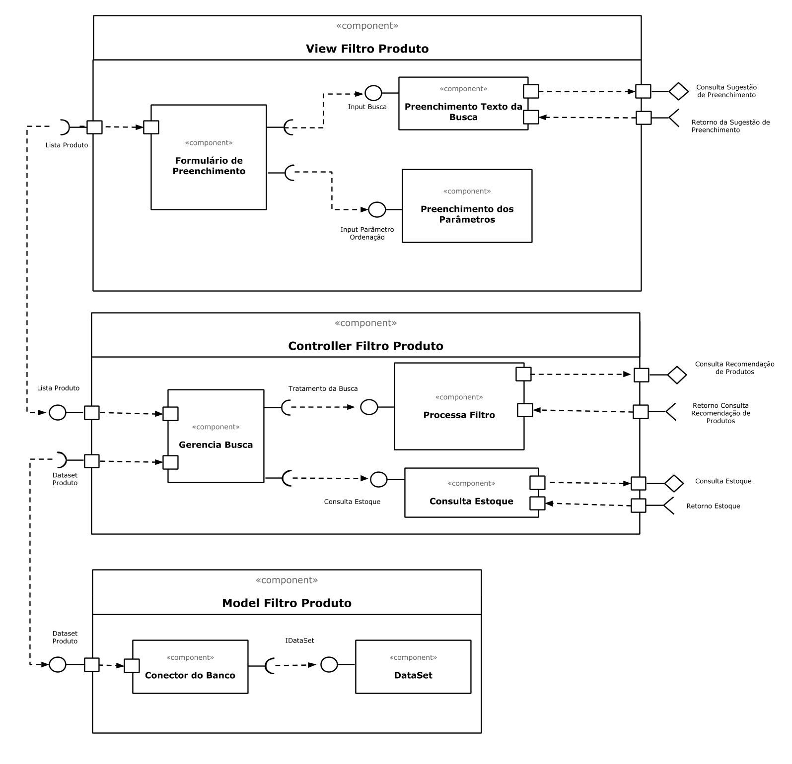

## Tarefa 1

## Tarefa 2

**HTML**
~~~html

~~~

**JavaScript**
~~~javascript
class Barra extends React.Component {
  render() {
    let resultado = "";
    for (let b = 1; b <= this.props.tamanho; b++)
      resultado += "=";
    return resultado;
  }
  
  randSmyle() {
       let caracter = [':D', ':P', ':-)', '=)', 'q=)', ':~)'];
       let rand = Math.floor(Math.random() * (6 - 0)) + 0;
       return caracter[rand];
  }
}

const elemento = 

                   <h2>O dinossauro</h2>
                   <Barra tamanho="10"/>
                   <h2>pulou na lama.</h2>
                 

ReactDOM.render(elemento, 
        document.getElementById("root"));

function showSmyle() {
  const smyle = (
    

      <h1>{new Barra().randSmyle()}</h1>
    

  );
  ReactDOM.render(smyle, document.getElementById('smyle'));
} setInterval(showSmyle, 1000);
~~~
