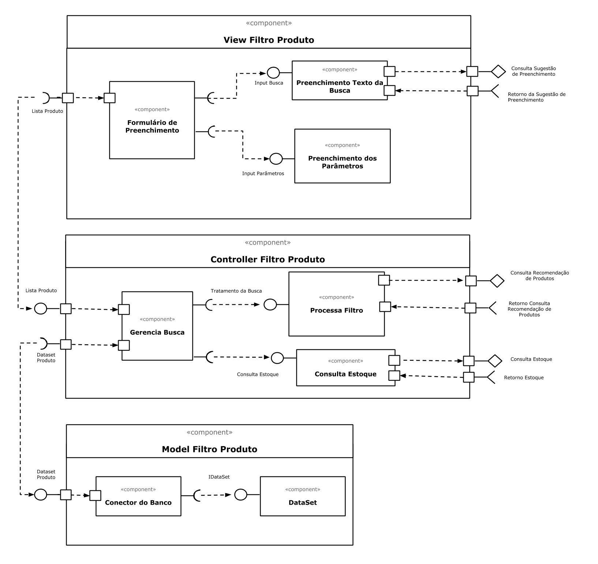

## Tarefa 1

## Tarefa 2

**HTML**
~~~html

~~~

**JavaScript**
~~~javascript
class Barra extends React.Component {
  render() {
    let resultado = "";
    for (let b = 1; b <= this.props.tamanho; b++)
      resultado += "=";
    return resultado;
  }
}

const elemento = 

                   <h2>O dinossauro</h2>
                   <Barra tamanho="10"/>
                   <h2>pulou na lama.</h2>
                 

ReactDOM.render(elemento, 
        document.getElementById("root"));
~~~
